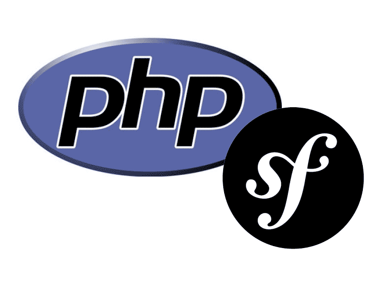

# MVC kurs 2024

[](https://scrutinizer-ci.com/g/jkberiksson/bth-mvc/?branch=main)
[](https://scrutinizer-ci.com/g/jkberiksson/bth-mvc/?branch=main)
[](https://scrutinizer-ci.com/g/jkberiksson/bth-mvc/build-status/main)



## Beskrivning

En webbplats byggd med PHP-ramverkert Symfony. Innehåller me-sidan till mvc-kursen på BTH 2024. Allting sparas sedan i detta git-repo.

## Installation och användning

För att köra projektet lokalt, följ dessa steg:

1. Klona detta repository till din lokala maskin med följande kommando(OBS!! SSH):

   ```bash
   git clone git@github.com:jkberiksson/bth-mvc.git
   ```

2. Navigera till projektmappen:

   ```bash
   cd bth-mvc
   ```

3. Installera projektets beroenden:

   ```bash
   composer install
   ```

   ```bash
   npm install
   ```

4. Bygg projektet:

   ```bash
   npm run build
   ```

5. Starta programmet lokalt:

   ```bash
    php -S localhost:8888 -t public
   ```
